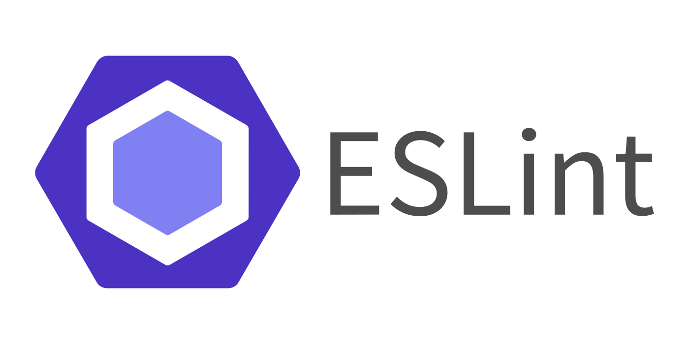
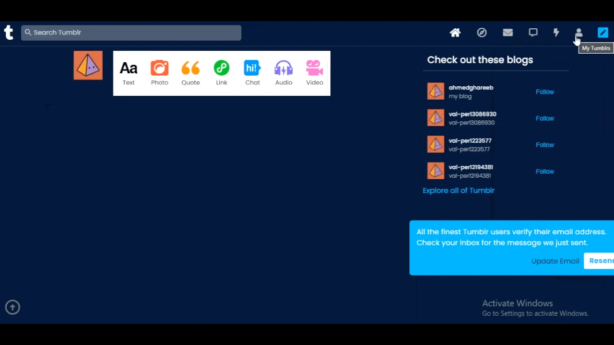
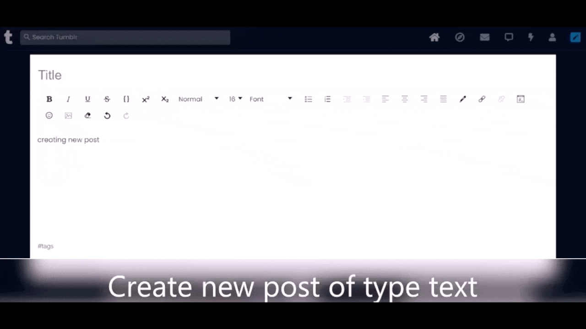
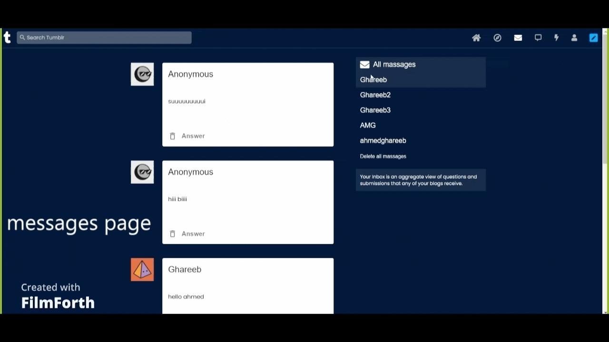
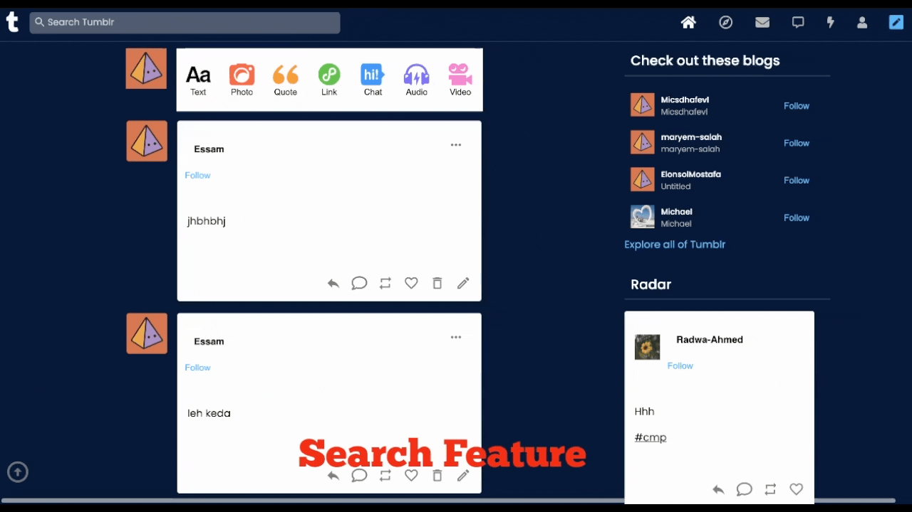
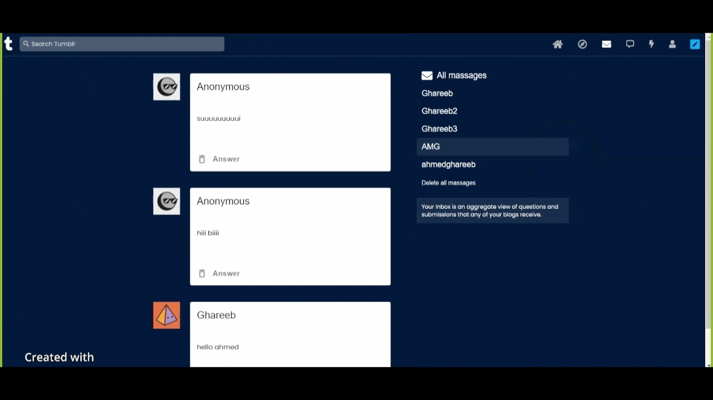
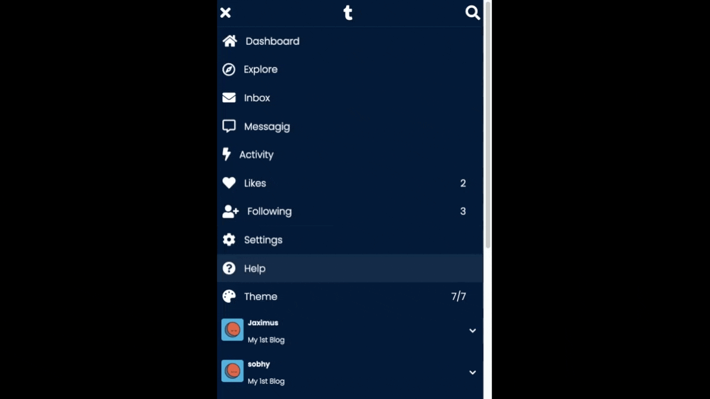
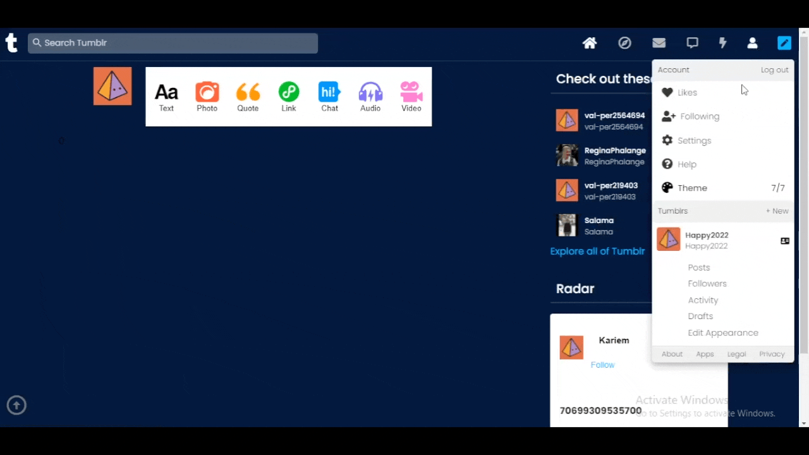

  

 
 

   This website is a replica of the widely known <a href="tumblr.com">Tumblr</a>. Made with passion by a team of six computer engineering juniors at Cairo University and serves as a project for the software engineering fundementals course (CMP3030).  You can visit the website at:
  

  <a href="https://tumblr.social">https://tumblr.social</a>
   
  
 Note that the backend server and frontend are deployed seperately, they're not guaranteed to stay there forever, these are the steps to run the project on your machine:

➤ Clone the project
 
➤ cd tumblr_replica
 
➤ npm start
 
➤ npx json-server --watch data/db.json --port 8000 (to run on the mock server)
 
 

>After cloning, Github might not get folder names correctly. If you get an error, Make sure that it's tumblr-replica/src/components/NavTabs/NavTabs and not tumblr-replica/src/components/NavTabs/Navtabs

   <h2> Technologies used </h2>
  
  
  
   
  
  
  
   
   
    &nbsp;&nbsp;&nbsp;&nbsp;&nbsp;&nbsp;&nbsp;&nbsp;&nbsp;&nbsp;&nbsp;&nbsp;&nbsp;&nbsp;&nbsp;&nbsp;&nbsp;&nbsp;&nbsp;&nbsp;&nbsp;&nbsp;&nbsp;&nbsp;&nbsp;&nbsp;&nbsp;&nbsp;&nbsp;&nbsp;&nbsp;&nbsp;&nbsp;&nbsp;&nbsp;&nbsp;&nbsp;&nbsp;&nbsp;&nbsp;&nbsp;&nbsp;&nbsp;&nbsp;&nbsp;&nbsp;&nbsp;
  

  

 
 
  

  <h2> 🛫 <b>  Now it's time quick demo on the main features </b> 🛬 </h2>
   
  <h3>Take a deep breath </h3>
   
  
   
  <h3> Let's begin </h3>
   
  <h3><b> Sign Up & Login</b> </h3>
  
   
  <h3><b> Email Verification</b> </h3>
  
   
  <h3><b> Dashboard & Posts</b> </h3>
  
   
  <h3><b> Trending Page</b> </h3>
  
   
  <h3><b> Inbox Page</b> </h3>
  
   
  <h3><b> Chat </b> </h3>
  
   
  <h3><b> Search </b> </h3>
  
   
  <h3><b> Navigation Bar</b> </h3>
  
   
  <h3><b>Profile</b> </h3>
  
   
  <h3><b>Profile-related Pages</b> </h3>
  
   
  <h3><b>Following & Followers</b> </h3>
  
   
  <h3><b>Responsiveness & Themes</b> </h3>
  
   

  <h3><b>Settings</b> </h3>
  
   

  <h2> ❤️️ <b>  Thank you. </b> ❤️️ </h2>

